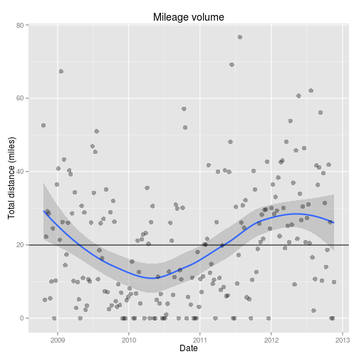

Analysis of my running log
==========================
Some analysis of my running and racing logs. Last updated `2012-11-25`.

R packages I use:

```r
require(RCurl, quietly = TRUE)
require(ggplot2, quietly = TRUE)
require(xtable, quietly = TRUE)
```


Weekly running volume
----------------------
A weekly running volume report from [Garmin Connect](http://connect.garmin.com/) was imported into Google Docs. The data was last imported on `2012-11-25`.

The following data processing operations will be done:
* Create variable `week` as a date variable using the character variable `Time.Period`
* Create variable `month` as a date variable using `week`
* Convert variable `Distance` to numeric
* Create variable `hours` as a numeric value of hours of running using the character variable `Time`


```r
url <- getURL("https://docs.google.com/spreadsheet/pub?key=0ApyhYsT8Gi-EdEg3aDBNRGR6U2lvdU5idTJkY0dSYVE&single=true&gid=0&output=csv", 
    cainfo = system.file("CurlSSL", "cacert.pem", package = "RCurl"))
classes <- c("character", "integer", rep("character", 8))
df <- read.csv(textConnection(url), header = TRUE, sep = ",", colClasses = classes)
df$week <- as.Date(df$Time.Period, format = "%m/%d/%Y")
df$month <- as.Date(paste("1", format(df$week, "%b %Y")), format = "%d %b %Y")
df$Distance <- as.numeric(df$Distance)
```

```
## Warning: NAs introduced by coercion
```

```r
df$Distance[is.na(df$Distance)] <- 0
Time <- df$Time
Time[Time == ":"] <- "00:00:00"
h <- rep(NULL, length(Time))
m <- rep(NULL, length(Time))
s <- rep(NULL, length(Time))
h <- as.numeric(sapply(strsplit(Time, ":"), "[[", 1))
m <- as.numeric(sapply(strsplit(Time, ":"), "[[", 2))
s <- as.numeric(sapply(strsplit(Time, ":"), "[[", 3))
is.incorrect <- s == 0
s[is.incorrect] <- m[is.incorrect]
m[is.incorrect] <- h[is.incorrect]
h[is.incorrect] <- 0
df$hours <- h + (m/60) + (s/(60 * 60))
head(df)
```

```
##   Time.Period Count Distance    Time Elevation.Gain Avg.Speed Avg.HR
## 1  11/19/2012     3     9.88 2:11:30           2549       4.2     --
## 2  11/12/2012     1     0.00       :             --        --     --
## 3   11/5/2012     1     0.00       :             --        --     --
## 4  10/29/2012     1    26.20 5:28:29             --        --     --
## 5  10/22/2012     4    41.92 6:44:12           6730       6.2     --
## 6  10/15/2012     3    18.66 2:37:22            458       7.1     --
##   Avg.Run.Cadence Avg.Bike.Cadence Calories       week      month hours
## 1              --               --      730 2012-11-19 2012-11-01 2.192
## 2              --               --       -- 2012-11-12 2012-11-01 0.000
## 3              --               --       -- 2012-11-05 2012-11-01 0.000
## 4              --               --       -- 2012-10-29 2012-10-01 5.475
## 5              --               --     4612 2012-10-22 2012-10-01 6.737
## 6              --               --     2086 2012-10-15 2012-10-01 2.623
```


The dataset includes weeks `2008-10-20` to `2012-11-19`.

Plot monthly mileage volume and time-on-feet. It is obvious that my training volume suffered greatly when I was teaching starting around March 2009 through June 2011. Also, Hazel was born in December 2009, which also affected my training volume.

```r
ggplot(df, aes(x = week, y = Distance)) + geom_smooth(size = 1) + geom_point(alpha = 1/3, 
    size = 3) + geom_hline(y = median(df$Distance)) + labs(title = "Mileage volume", 
    x = "Date", y = "Total distance (miles)")
```

```
## geom_smooth: method="auto" and size of largest group is <1000, so using
## loess. Use 'method = x' to change the smoothing method.
```

 


```r
ggplot(df, aes(x = week, y = hours)) + geom_smooth(size = 1) + geom_point(alpha = 1/3, 
    size = 3) + labs(title = "Time-on-feet", x = "Date", y = "Total time-on-feet (hours)")
```

```
## geom_smooth: method="auto" and size of largest group is <1000, so using
## loess. Use 'method = x' to change the smoothing method.
```

 


Races
-----
Here is some data on my marathon and ultramarathon race history. The data was taken from my [Marathon Maniacs race log](http://www.marathonmaniacsdb.com/Maniacs/MyMarathons.asp?ManiacId=369) and imported into Google Docs.

```r
url <- getURL("https://docs.google.com/spreadsheet/pub?key=0ApyhYsT8Gi-EdEh5azZuRGVYWnVkem0wck1WVEwyZ0E&single=true&gid=0&output=csv", 
    cainfo = system.file("CurlSSL", "cacert.pem", package = "RCurl"))
df <- read.csv(textConnection(url), header = TRUE, sep = ",")
df$date <- as.Date(df$date, format = "%m/%d/%Y")
df$year <- as.integer(format(df$date, format = "%Y"))
df$category <- rep(NA, length(df$distance))
df$category[df$distance == "Marathon"] <- "Marathon"
df$category[df$distance != "Marathon"] <- "Ultra"
df$km[df$distance == "Marathon"] <- 26.2 * 1.60934
df$distance <- as.character(df$distance)
is.km <- grepl("km", tolower(df$distance))
is.mi <- grepl("mi", tolower(df$distance))
list.km <- strsplit(df$distance[is.km], " ")
list.mi <- strsplit(df$distance[is.mi], " ")
df$km[is.km] <- as.numeric(sapply(list.km, "[[", 1))
df$km[is.mi] <- as.numeric(sapply(list.mi, "[[", 1)) * 1.60934
df <- subset(df, select = -c(distance))
head(df)
```

```
##   id                    race       date surface year category    km
## 1 61   Silver Falls Marathon 2012-11-03   Trail 2012 Marathon 42.16
## 2 60 Columbia Gorge Marathon 2012-10-28    Road 2012 Marathon 42.16
## 3 59       Victoria Marathon 2012-10-07    Road 2012 Marathon 42.16
## 4 58             Volcanic 50 2012-09-15   Trail 2012    Ultra 50.00
## 5 57             Mt. Hood 50 2012-07-28   Trail 2012    Ultra 80.47
## 6 56   Siskiyou Out Back 50K 2012-07-14   Trail 2012    Ultra 50.00
```


Plot the number of races by category by year. I started ultrarunning in 2008. By 2012, I switched from running primarily marathons to running ultramarathons.

```r
df$count <- rep(1, nrow(df))
aggRaces <- aggregate(count ~ category + year, data = df, sum)
isMarathon <- aggRaces$category == "Marathon"
isUltra <- aggRaces$category == "Ultra"
aggRaces$year <- factor(aggRaces$year)
aggRaces$cumsum[isMarathon] <- cumsum(aggRaces$count[isMarathon])
aggRaces$cumsum[isUltra] <- cumsum(aggRaces$count[isUltra])
print(xtable(aggRaces, digits = 0), type = "html")
```

<!-- html table generated in R 2.15.1 by xtable 1.7-0 package -->
<!-- Sun Nov 25 22:24:09 2012 -->
<TABLE border=1>
<TR> <TH>  </TH> <TH> category </TH> <TH> year </TH> <TH> count </TH> <TH> cumsum </TH>  </TR>
  <TR> <TD align="right"> 1 </TD> <TD> Marathon </TD> <TD> 2004 </TD> <TD align="right"> 1 </TD> <TD align="right"> 1 </TD> </TR>
  <TR> <TD align="right"> 2 </TD> <TD> Marathon </TD> <TD> 2005 </TD> <TD align="right"> 3 </TD> <TD align="right"> 4 </TD> </TR>
  <TR> <TD align="right"> 3 </TD> <TD> Marathon </TD> <TD> 2006 </TD> <TD align="right"> 4 </TD> <TD align="right"> 8 </TD> </TR>
  <TR> <TD align="right"> 4 </TD> <TD> Marathon </TD> <TD> 2007 </TD> <TD align="right"> 3 </TD> <TD align="right"> 11 </TD> </TR>
  <TR> <TD align="right"> 5 </TD> <TD> Marathon </TD> <TD> 2008 </TD> <TD align="right"> 6 </TD> <TD align="right"> 17 </TD> </TR>
  <TR> <TD align="right"> 6 </TD> <TD> Ultra </TD> <TD> 2008 </TD> <TD align="right"> 1 </TD> <TD align="right"> 1 </TD> </TR>
  <TR> <TD align="right"> 7 </TD> <TD> Marathon </TD> <TD> 2009 </TD> <TD align="right"> 6 </TD> <TD align="right"> 23 </TD> </TR>
  <TR> <TD align="right"> 8 </TD> <TD> Ultra </TD> <TD> 2009 </TD> <TD align="right"> 5 </TD> <TD align="right"> 6 </TD> </TR>
  <TR> <TD align="right"> 9 </TD> <TD> Marathon </TD> <TD> 2010 </TD> <TD align="right"> 5 </TD> <TD align="right"> 28 </TD> </TR>
  <TR> <TD align="right"> 10 </TD> <TD> Ultra </TD> <TD> 2010 </TD> <TD align="right"> 5 </TD> <TD align="right"> 11 </TD> </TR>
  <TR> <TD align="right"> 11 </TD> <TD> Marathon </TD> <TD> 2011 </TD> <TD align="right"> 6 </TD> <TD align="right"> 34 </TD> </TR>
  <TR> <TD align="right"> 12 </TD> <TD> Ultra </TD> <TD> 2011 </TD> <TD align="right"> 5 </TD> <TD align="right"> 16 </TD> </TR>
  <TR> <TD align="right"> 13 </TD> <TD> Marathon </TD> <TD> 2012 </TD> <TD align="right"> 5 </TD> <TD align="right"> 39 </TD> </TR>
  <TR> <TD align="right"> 14 </TD> <TD> Ultra </TD> <TD> 2012 </TD> <TD align="right"> 6 </TD> <TD align="right"> 22 </TD> </TR>
   </TABLE>

```r
incr <- 5
maxy <- incr * ceiling(sum(df$count)/incr)
ggplot(aggRaces, aes(x = year, weight = cumsum, fill = category)) + geom_bar() + 
    labs(title = "Cumulative number of races", x = "Year", y = "", fill = "Distance") + 
    scale_y_continuous(limits = c(0, maxy))
```

 


Plot the number of races by surface type by year. In 2008, I also ran my first trail race. By 2011, I switched primarily to trail racing.

```r
df$count <- rep(1, nrow(df))
aggRaces <- aggregate(count ~ surface + year, data = df, sum)
isRoad <- aggRaces$surface == "Road"
isTrail <- aggRaces$surface == "Trail"
aggRaces$year <- factor(aggRaces$year)
aggRaces$cumsum[isRoad] <- cumsum(aggRaces$count[isRoad])
aggRaces$cumsum[isTrail] <- cumsum(aggRaces$count[isTrail])
print(xtable(aggRaces, digits = 0), type = "html")
```

<!-- html table generated in R 2.15.1 by xtable 1.7-0 package -->
<!-- Sun Nov 25 22:24:11 2012 -->
<TABLE border=1>
<TR> <TH>  </TH> <TH> surface </TH> <TH> year </TH> <TH> count </TH> <TH> cumsum </TH>  </TR>
  <TR> <TD align="right"> 1 </TD> <TD> Road </TD> <TD> 2004 </TD> <TD align="right"> 1 </TD> <TD align="right"> 1 </TD> </TR>
  <TR> <TD align="right"> 2 </TD> <TD> Road </TD> <TD> 2005 </TD> <TD align="right"> 3 </TD> <TD align="right"> 4 </TD> </TR>
  <TR> <TD align="right"> 3 </TD> <TD> Road </TD> <TD> 2006 </TD> <TD align="right"> 4 </TD> <TD align="right"> 8 </TD> </TR>
  <TR> <TD align="right"> 4 </TD> <TD> Road </TD> <TD> 2007 </TD> <TD align="right"> 3 </TD> <TD align="right"> 11 </TD> </TR>
  <TR> <TD align="right"> 5 </TD> <TD> Road </TD> <TD> 2008 </TD> <TD align="right"> 5 </TD> <TD align="right"> 16 </TD> </TR>
  <TR> <TD align="right"> 6 </TD> <TD> Trail </TD> <TD> 2008 </TD> <TD align="right"> 2 </TD> <TD align="right"> 2 </TD> </TR>
  <TR> <TD align="right"> 7 </TD> <TD> Road </TD> <TD> 2009 </TD> <TD align="right"> 6 </TD> <TD align="right"> 22 </TD> </TR>
  <TR> <TD align="right"> 8 </TD> <TD> Trail </TD> <TD> 2009 </TD> <TD align="right"> 5 </TD> <TD align="right"> 7 </TD> </TR>
  <TR> <TD align="right"> 9 </TD> <TD> Road </TD> <TD> 2010 </TD> <TD align="right"> 6 </TD> <TD align="right"> 28 </TD> </TR>
  <TR> <TD align="right"> 10 </TD> <TD> Trail </TD> <TD> 2010 </TD> <TD align="right"> 4 </TD> <TD align="right"> 11 </TD> </TR>
  <TR> <TD align="right"> 11 </TD> <TD> Road </TD> <TD> 2011 </TD> <TD align="right"> 4 </TD> <TD align="right"> 32 </TD> </TR>
  <TR> <TD align="right"> 12 </TD> <TD> Trail </TD> <TD> 2011 </TD> <TD align="right"> 7 </TD> <TD align="right"> 18 </TD> </TR>
  <TR> <TD align="right"> 13 </TD> <TD> Road </TD> <TD> 2012 </TD> <TD align="right"> 3 </TD> <TD align="right"> 35 </TD> </TR>
  <TR> <TD align="right"> 14 </TD> <TD> Trail </TD> <TD> 2012 </TD> <TD align="right"> 8 </TD> <TD align="right"> 26 </TD> </TR>
   </TABLE>

```r
incr <- 5
maxy <- incr * ceiling(sum(df$count)/incr)
ggplot(aggRaces, aes(x = year, weight = cumsum, fill = surface)) + geom_bar() + 
    labs(title = "Cumulative number of races", x = "Year", y = "", fill = "Surface") + 
    scale_y_continuous(limits = c(0, maxy))
```

 

